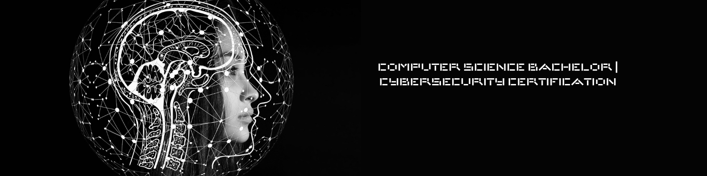

# Computer Science Student

### Education
B.S, Computer Science | Southern Arkansas University, Magnolia
  - Expected Graduation: May 2026
  - Honors Student

### World Experience
Library Student Worker | Magale Library at Southern Arkansas University, Magnolia
  - Takes care of the check-out desk by helping students rent library materials and use library resources
Assists students in their literature research.
  - Assists students in their literature research.
    
Piano Teacher | Casablanca, Morocco & Magnolia, Arkansas
  - Gave several piano lessons at El Ghali Art Conservatory in Casablanca
  - Teaches music theory to beginners

### Academic Projects
  - CERTIFICATE OF COMPLETION - ARKANSAS SUMMER RESEARCH INSTITUTE (ASRI), Data Analytics that are Robust and Trusted (DART)
  - DART Research Project: Persistent Homology & Segment Anything Model (PH-SAM)
  - Cybersecurity Research Project: Phishing Detection in Mobile Phones

### Programming Skills
  - PYTHON
  - JAVA
  - C++
  - R
  - MySQL
  - PHP
  - PHPMyAdmin
  - Kotlin
  - xml
  - LINUX Terminal
  - Jupyter Notebook
  - Google Colaboratory
  - Github

